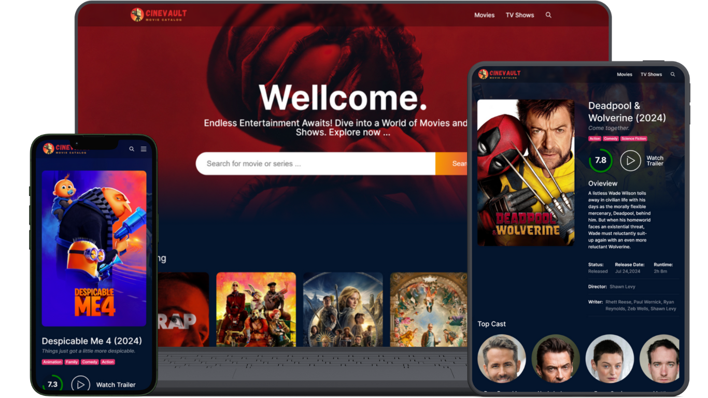
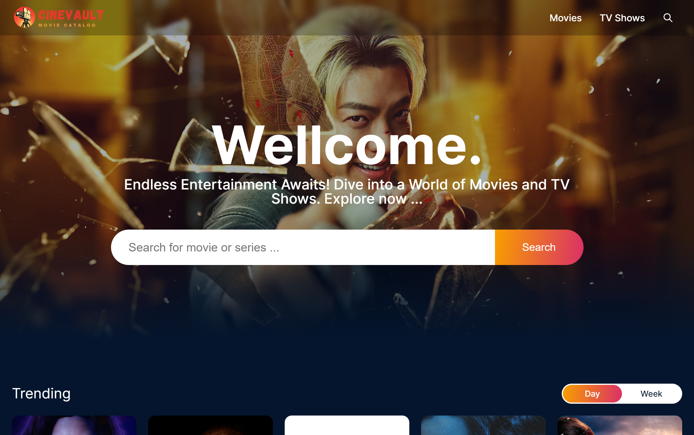
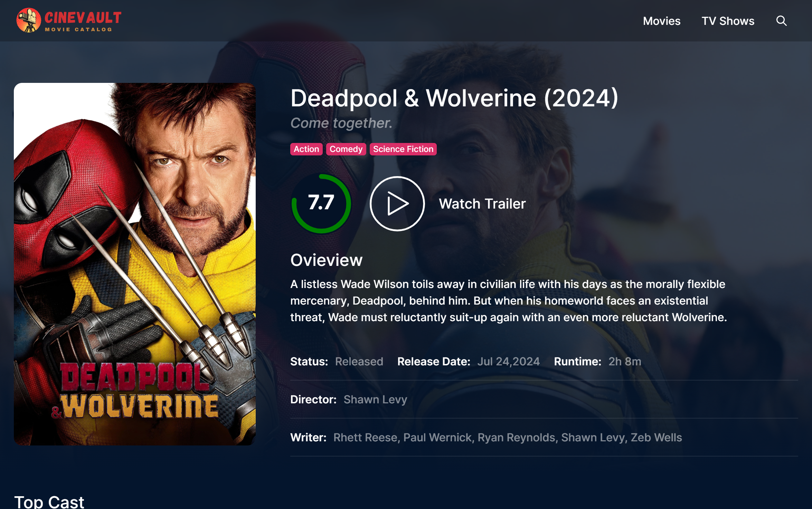
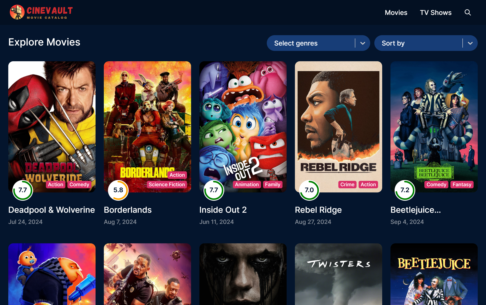

# **CineVault** — A premium, high-performance movie & TV show discovery platform

[](#)
[](https://cinevault-kripanshu.vercel.app/)
[](#)

<p align="center">
  
</p>

### 📖 Why CineVault Exists
CineVault was created to solve the problem of fragmented and sluggish movie discovery tools. Designed as a state-of-the-art Single Page Application (SPA), it provides an immersive, cinematic catalog interface using high-performance animations, Redux-powered state caching, and a secure backend API proxy wrapper to deliver real-time TMDB details without sacrificing performance or security.

---

### ✨ Features
- **Dynamic Home Feed**: Real-time trending, popular, and top-rated sections with dynamically generated recommendations.
- **Comprehensive Details Page**: In-depth media details, cast members, official video trailers (via React Player), similar titles, and movie recommendations.
- **Advanced Exploration & Filtering**: Multi-genre selectivity and sorting (by popularity, release date, rating) using customized UI dropdowns.
- **Robust Live Search**: Instant queries across movies, series, and cast members.
- **Responsive Design & Rich Transitions**: Optimized layouts with lazy-loaded images, circular rating progress indicators, and glassmorphic navigation overlays.

---

### 🛠️ Tech Stack
- **Frontend Core**: React 18, Vite (for blazing fast bundling)
- **State Management**: Redux Toolkit & React-Redux
- **Styling**: Sass (SCSS) for customized tokenized layout systems
- **Routing**: React Router DOM (v6)
- **Networking**: Axios, React Infinite Scroll, React Lazy Load Image
- **Hosting & Infrastructure**: Vercel (frontend deployment with custom redirect routing configurations)

---

### 📸 Screenshot Gallery

#### Details & Cast View


#### Exploration & Filtering


#### Search & Results


---

### 🚀 Quick Start & Installation

To run this project locally, follow these steps:

1. **Clone the repository**:
   ```bash
   git clone https://github.com/kripanshu-singh/CineVault.git
   ```

2. **Navigate into the project directory**:
   ```bash
   cd CineVault
   ```

3. **Install the dependencies**:
   ```bash
   npm install
   ```

4. **Set up environment variables**:
   Create a `.env` file in the root directory and add your TMDB API Key:
   ```env
   VITE_APP_TMDB_TOKEN=your_tmdb_api_key_here
   ```

5. **Start the local development server**:
   ```bash
   npm run dev
   ```

6. **Build for production**:
   ```bash
   npm run build
   ```

---

### 🌐 Live Link
Visit the deployed application at: **[https://cinevault-kripanshu.vercel.app/](https://cinevault-kripanshu.vercel.app/)**

---

### ✍️ Author & Signature

**Kripanshu Singh**  
- 🌐 **Portfolio**: [kripanshu.me](https://kripanshu.me/)  
- 💼 **LinkedIn**: [in/kripanshu-singh](https://www.linkedin.com/in/kripanshu-singh/)  
- 🐙 **GitHub**: [github/kripanshu-singh](https://github.com/kripanshu-singh)  
- 📄 **Resume**: [kripanshu.me/resume.pdf](https://kripanshu.me/resume.pdf)  
- ✉️ **Mail**: [hi@kripanshu.me](mailto:hi@kripanshu.me)  
